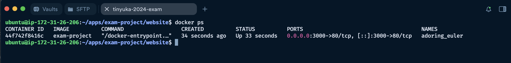

# Tinyuka 2024 Second Semester Exam Project
> ### Author: Samuel Ndubuisi Igwe (ALT/SOE/024/0877)

## Project links
- [HTTP Access On Instance IP - 13.61.178.209](http://13.61.178.209)
- [HTTPS Access On Custom Domain - igwe-tinyuka-2024.run.place](https://igwe-tinyuka-2024.run.place)

Here, I have outlined the steps taken to complete this project, starting from adding [deployable dynamic website](./website) to this repository to setting up ec2 instance on a newly created aws account. Below are all the steps taken.

## Step 1: I added a deployable React project page built with vite - [Read more](./website/README.md)

## Step 2: Aws Account Creation
Here I went through a five-step form filling that involves:
- Email verification
- Phone number verification
- Filling of address and billing information
- Completing the billing information by providing a virtual dollar card
- Selecting basic support plan (which is free)


## Step 3: EC2 Instance Provisioning
Below are the steps I took to provision a free EC2 instance on AWS console

1. **Navigate to EC2 Dashboard**
    - Search for "EC2" in AWS Console
    - Click "Launch Instance"

2. **Configure Instance**
    - **Name**: Here I gave the instance a descriptive name - `tinyuka-exam-project`
    - **AMI**: I chose "Ubuntu Server 22.04 LTS" (Free Tier eligible)
    - **Instance Type**: I chose `t2.micro` (Free Tier eligible)
    - **Key Pair**: I Created and downloaded a new RSA-pem key pair after giving it a name
    - **Storage**: I left it at the default 8 GB which should be enough for the project.

3. **Security Group Setup**
    - As part of the setup, under network settings, I chose the option to auto create a security group and enabled `ssh`, `http` and `https` traffic on the instance
    - Below is the breakdown of the rules added:
   ```
     Type: SSH, Port: 22, Source: My IP (for secure access)
     Type: HTTP, Port: 80, Source: 0.0.0.0/0
     Type: HTTPS, Port: 443, Source: 0.0.0.0/0
   ```

4. **Instance Launch**
    - After Reviewing the settings, I clicked "Launch Instance" and waited for the instance to be in "running" state before proceeding to connect

## Step 4: Connection to server
After successfully `launching` the instance, and waiting for it to be in the `running state` I took the following steps to connect to the server using [Termius](https://termius.com/)
- I first created a host on termius by supplying the following information:
  ```
    - Label: Here I used a descriptive value that I can remember
    - Host: Here I used the instance Public DNS
  ```
  Before I clicked the `connect` button, I went ahead to import the instance private key and attached it to the host.
- I imported the instance private to Termius keychain and then clicked the `connect` button
- After connecting, I got to the window below:


> NOTE: Before proceeding to the next step, I ran the following command to update and upgrade exciting packages:
```shell
sudo apt update && sudo apt ugrade -y
```

## Step 5: Server (Nginx) Installation and Setup
To be able to deploy my project, I have to install a nginx server which, in my case, will serve as a reverse proxy for my dockerized project.
I ran the following command and got below image output that indicates that nginx was successfully setup:

```shell
# Update package list
sudo apt update

# Install Nginx
sudo apt install nginx -y

# Check status
sudo systemctl status nginx
```
 | 

## Step 6: Docker Installation and Setup
To ease the process of application deployment and also have a tooling independent platform, I chose the option of containerizing my application which requires docker installation.
Here are the commands I ran to set up docker:

```shell
# Install required packages
sudo apt install apt-transport-https ca-certificates curl software-properties-common -y

# Add Docker's official GPG key
curl -fsSL https://download.docker.com/linux/ubuntu/gpg | sudo gpg --dearmor -o /usr/share/keyrings/docker-archive-keyring.gpg

# Add Docker repository
echo "deb [arch=$(dpkg --print-architecture) signed-by=/usr/share/keyrings/docker-archive-keyring.gpg] https://download.docker.com/linux/ubuntu $(lsb_release -cs) stable" | sudo tee /etc/apt/sources.list.d/docker.list > /dev/null

# Update package list
sudo apt update

# Install Docker
sudo apt install docker-ce -y

# Add user to docker group (to run docker without sudo)
sudo usermod -aG docker ${USER}
```
After installation below is the docker status screen:


## Step 7: Application Deployment
To deploy application, I took the following steps:
**Repository setup**
  - I pushed the application code to a public repository [https://github.com/theigwe/tinyuka-2024-second-semester-exam-project.git](https://github.com/theigwe/tinyuka-2024-second-semester-exam-project.git)

**Code import and running with docker** 
> After pushing the code to [GitHub](https://github.com) I went back into the server and ran the following code to spin up the application
```shell
# Create a folder to keep application files
mkdir apps

# Clone the code from github into a specific folder
git clone https://github.com/theigwe/tinyuka-2024-second-semester-exam-project.git exam-project

# Move into project directory
cd exam-project

# Ensure project is on the main branch
git checkout main

# The application is located into another folder website
cd website

# Build project with docker and set a tag (exam-project)
docker build -t exam-project .

# To run the application, the exposed port on docker is mapped to port 3000 of the server (this port will be used to creat a reverse proxy that serves the application)
docker run -d -p 3000:80 exam-project
```
**Below show the docker instance running the application image and exposing it on port `3000`**


## Step 8: Configured Nginx as Reverse Proxy
At this point, to be able to serve port 3000, I configured Nginx to serve as a reverse proxy both for the instance IP address and a custom domain.

Below are the commands I ran to configure the reverse proxy for the custom domain

```shell
# Create empty server config file
sudo nano /etc/nginx/sites-available/igwe-tinyuka-2024.run.place
```

> The following configuration was added to `/etc/nginx/sites-available/igwe-tinyuka-2024.run.place`
```nginx
server {
    listen 80;
    listen [::]:80;

    server_name igwe-tinyuka-2024.run.place;

    location / {
        proxy_set_header Host $host;
        proxy_set_header X-Real-IP $remote_addr;
        proxy_set_header X-Forwarded-For $proxy_add_x_forwarded_for;
        proxy_set_header X-Forwarded-Proto $scheme;
        proxy_pass http://localhost:3000;
    }
}
```

```shell
# Added configuration to sites-enabled directory
sudo ln -s /etc/nginx/sites-available/igwe-tinyuka-2024.run.place /etc/nginx/sites-enabled/
```

> To ensure that the default configuration serves the content running on port 3000, the content of `/etc/nginx/sites-available/default` was replaced with the following:

```nginx
server {
    listen 80 default_server;;
    listen [::]:80 default_server;;

    server_name _;

    location / {
        proxy_set_header Host $host;
        proxy_set_header X-Real-IP $remote_addr;
        proxy_set_header X-Forwarded-For $proxy_add_x_forwarded_for;
        proxy_set_header X-Forwarded-Proto $scheme;
        proxy_pass http://localhost:3000;
    }
}
```

After that, I ran the following commands and went ahead to check the browser to see if the application is serving correctly:
```shell
# Test configurations for errors
sudo nginx -t
# Restart Nginx to apply changes
sudo systemctl restart nginx
```

**Result of the configurations**

 | 

## Step 9: Secure with Let's Encrypt SSL

To add ssl certificate using certbot, I ran the following commands:

```shell
# Install Certbot
sudo apt install certbot python3-certbot-nginx -y

# Obtain SSL certificate
sudo certbot --nginx -d igwe-tinyuka-2024.run.place

# Followed these prompts:
# - Enter email address
# - Agree to terms
# - Choose whether to share email with EFF


# Test automatic renewal
sudo certbot renew --dry-run

# Check certificate status
sudo certbot certificates
```

**Below are images of certbot status command and browser display of ssl enabled site**

 | 

